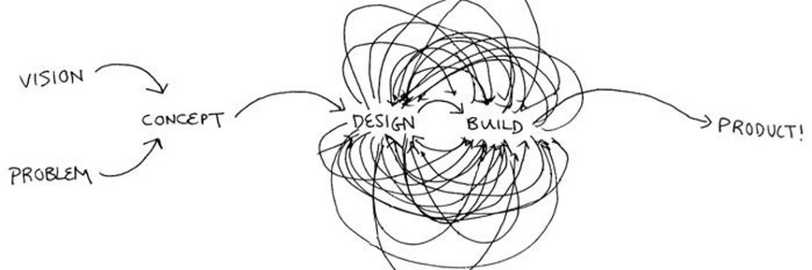

<table align="center" width="100%">
<tr>
<td>

  
  
   

  

  <h1 style="font-size: 50px;">Gobind Singh</h1>
  
  <h3>
    <a href="https://x.com/X4Git" target="_blank" style="text-decoration:none; color:#d3f277;">@X4Git</a>
  </h3>
  
  <h3>
    Passionate <b>Full Stack Developer</b> & <b>AI Enthusiast</b> building the future. 🚀 
    Learning Agentic Workflows & LLMs.
  </h3>

  

   📍 India 🇮🇳 &nbsp; • &nbsp; 🔗 <a href="https://github.com/G4Git">github.com/G4Git</a> &nbsp; • &nbsp; 📅 Joined 2023
  

 

## **💛 Let's Connect**

  &nbsp;&nbsp;&nbsp;

 

## **🏆 Achievements**

   

 

---

## **🛠️ Tech Stack**

<table border="1" width="100%">
    <tr>
        <th width="20%" style="text-align: center; color:#d3f277; font-size: 18px;">Category</th>
        <th width="80%" style="text-align: center; color:#d3f277; font-size: 18px;">Technologies</th>
    </tr>
    <tr>
        <td style="text-align: center; color:#e8e8e8;" align="center"><b>Frontend</b></td>
        <td align="center">
            &nbsp;
            &nbsp;
            &nbsp;
            &nbsp;
            &nbsp;
            &nbsp;
            &nbsp;
            &nbsp;
            &nbsp;
            
        </td>
    </tr>
    <tr>
        <td style="text-align: center; color:#e8e8e8;" align="center"><b>Backend</b></td>
        <td align="center">
            &nbsp;
            &nbsp;
            &nbsp;
            &nbsp;
            &nbsp;
            
        </td>
    </tr>
    <tr>
        <td style="text-align: center; color:#e8e8e8;" align="center"><b>Database</b></td>
        <td align="center">
            &nbsp;
            &nbsp;
            &nbsp;
            &nbsp;
            
        </td>
    </tr>
    <tr>
        <td style="text-align: center; color:#e8e8e8;" align="center"><b>AI & ML</b></td>
        <td align="center">
            &nbsp;
            &nbsp;
            &nbsp;
            
        </td>
    </tr>
    <tr>
        <td style="text-align: center; color:#e8e8e8;" align="center"><b>DevOps</b></td>
        <td align="center">
            &nbsp;
            &nbsp;
            &nbsp;
            &nbsp;
            
        </td>
    </tr>
    <tr>
        <td style="text-align: center; color:#e8e8e8;" align="center"><b>Tools</b></td>
        <td align="center">
            &nbsp;
            &nbsp;
            &nbsp;
            
        </td>
    </tr>
</table>

---

## **📈 Activity Graph**

  

 

---

☕ ***Turning coffee into code since 2023***

</td>
</tr>
</table>
