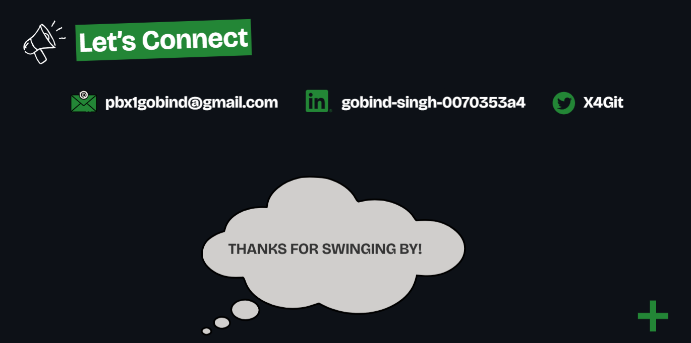

  
  <table >
    <tr>
      <td align="center" width="96">
        
         React
      </td>
      <td align="center" width="96">
        
         NodeJs
      </td>
      <td align="center" width="96">
        
         MongoDB
      </td>
      <td align="center" width="96">
        
         GEMINI
      </td>
      <td align="center" width="96">
        
         Tailwind CSS
      </td>
      <td align="center" width="96">
        
         FastAPI
      </td>
      <td align="center" width="96">
        
         MySql
      </td>
      <td align="center" width="96">
        
         LangChain
      </td>
      <td align="center" width="96">
        
         React-Native
      </td>
      <td align="center" width="96">
        
         Express
      </td>
       </tr>
    <tr>
      <td align="center" width="96">
        
         Redis
      </td>
      <td align="center" width="96">
        
         Jupyter
      </td>   
      <td align="center" width="96">
        
         Expo
      </td>
      <td align="center" width="96">
        
         Socket.IO
      </td>
      <td align="center" width="96">
        
         PineCone
      </td>
      <td align="center" width="96">
        
         Conda
      </td>
      <td align="center" width="96">
        
         Docker
      </td>
    </tr>
  </table>
  

